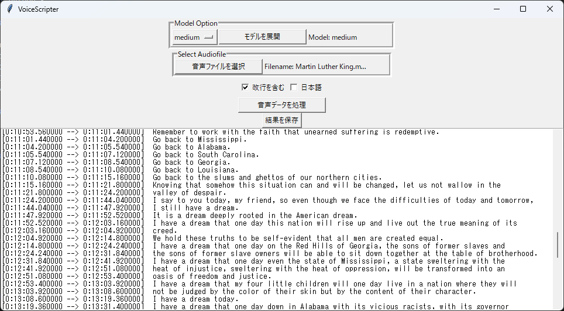

# VoiceScripter

# DEMO
簡単な文字起こしソフト
内部はwhisperで構成

# Requirement

* whisper
* python 3

# Usage

main.pyで実行  
1 Model Optionから好きなModelを展開  
2 Select Audiofileから文字起こし対象のファイルを選択  
3 音声データを処理　で文字起こし  
4 必要があればtxtで保存可能  

# Note

 - Largeは10GB, Mediumは5GBのメモリを要求
 - Largeはかなり遅い, 元データの長さとほぼ同時間かかる。
 - whisperはPATH通しておくこと

# License

特になし(FSF)
